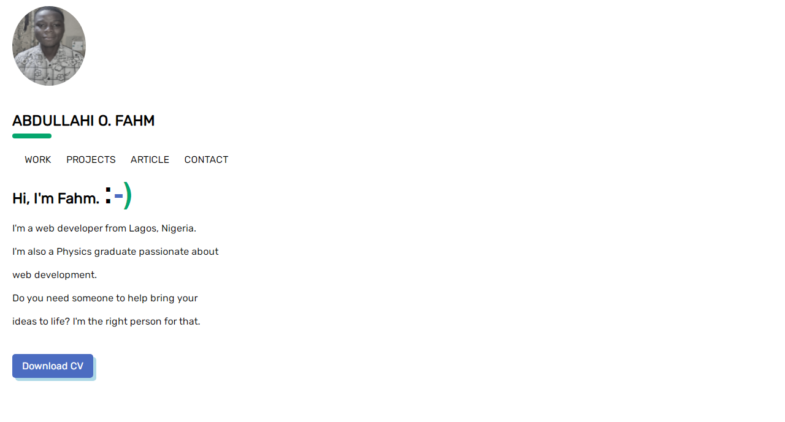

#### First Portfolio: Abdullahi Fahm Oladayo

#### Link to the live website:
[Portfolio](https://nifty-saha-a048c4.netlify.app/ "Portfolio live site")
___

#### Description : This a static website for my portfolio. It contains four webpages, I was challenged to build this.
___

#### What I learned?
1. Making CSS Animation 
```CSS
h2::after {
	content: "";
	position: absolute;
	height: 8px;
	width: 4rem;
	border-radius: 4px;
	background-color: #04A66D;
	bottom: -15px;
	left: 0;
}
```

___

> #### Tech Used : Html, CSS, git, Netlify, github.
___

#### Design image :


#### Credits: 
1. [Seb Kay](https://sebkay.com/ "Seb kay live website") 
1.  Scythe


